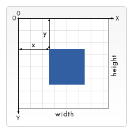

# canvas-learn

### canvas简介

`canvas` 是 HTML5 新定义的标签，通过使用脚本（通常是 JavaScript）绘制图形。
`<canvas>`  标签只是图形容器，相当于一个画布，`canvas` 元素本身是没有绘图能力的。所有的绘制工作必须在 JavaScript 内部完成，相当于使用画笔在画布上画画。

默认情况下，`<canvas>` 没有边框和内容。默认是一个 300*150 的画布，所以我们创建了 `<canvas>` 之后要对其设置宽高。

**我们可以通过html属性‘width’，‘height’来设置canvas的宽高，不可以通过 css 属性来设置宽高。因为通过 css 属性设置的宽高会使 canvas 内的图像按照 300\*150 时的比例放大或缩小**

### getContext() 获取上下文

`<canvas>` 起初是空白的。为了展示，首先脚本需要找到渲染上下文，然后在它的上面绘制

在 `<canvas>` 的世界，也有两大流派，一个是 `2d` 就是平面绘图，一个是 `webgl` 也就是 3D 立体绘图

因为 `webgl` 还未完全被主流的浏览器所支持，所以我们一般使用 `2d` 绘图

`<canvas>` 元素有一个叫做 `getContext()` 的方法

```
canvas.getContext(contextType, contextAttributes);
```

这个方法是用来获得渲染上下文和它的绘画功能

### Canvas 中的单位和坐标体系

因为 `getContext("2d")` 返回的是一个平面图形，所以采用的就是二维网格



1. canvas 采用的是左手背面坐标体系 (高中的数学知识...)，就是拿出左手，背面朝上，手指伸直，拇指与食指成 90度，让拇指对着自己的心脏，这时候拇指的方向就是 y 轴的正方向，食指的方向就是 x 轴的正方向
2. canvas 的坐标原点(0,0) 在左上角
3. canvas 以像素(px) 为单位，这个 `canvas` 的长宽设定是同一个单位类型

### 绘图顺序

把图画在画板上遵从的是现实生活中绘画的原则：后来画的会覆盖之前画的

### 超出大小

现实生活中绘画的时候肯定不会超出画板的范围，当然，`canvas` 中也不会

